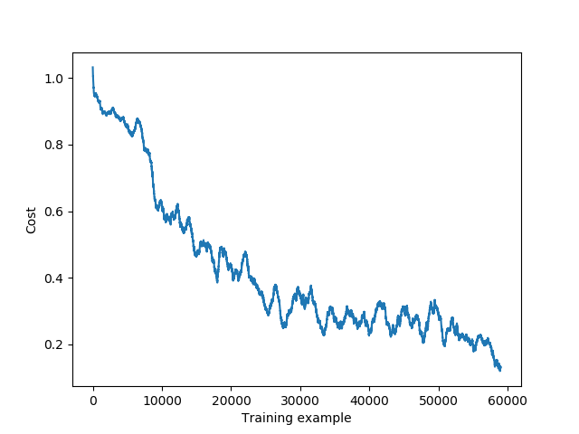

## Simple FNN
#####
A simple implementation of a fully connected neural network. The main purpose of this project was to build basic understanding of how neural networks work.

  

<i>Network learning over training examples.</i>

It is not suitable for production environments as it is a research project and therefore misses certain advanced features and optimizations. For more serious projects, please see [Tensorflow](https://github.com/tensorflow/tensorflow) or similar frameworks.
